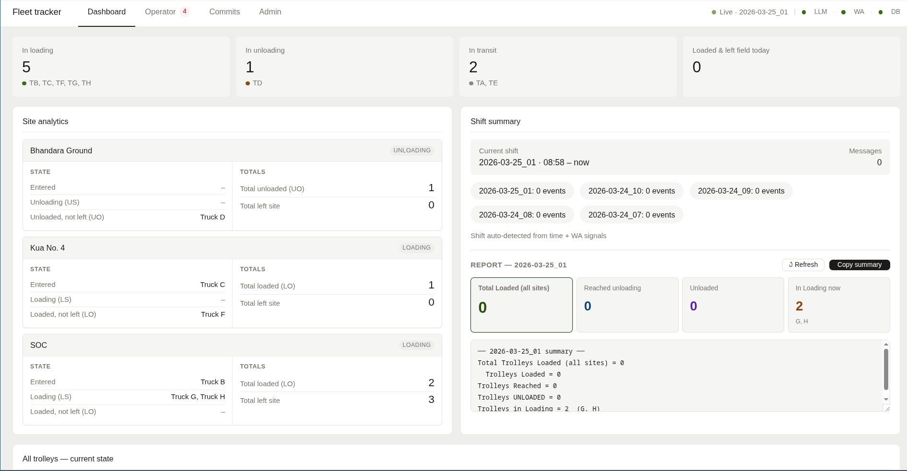
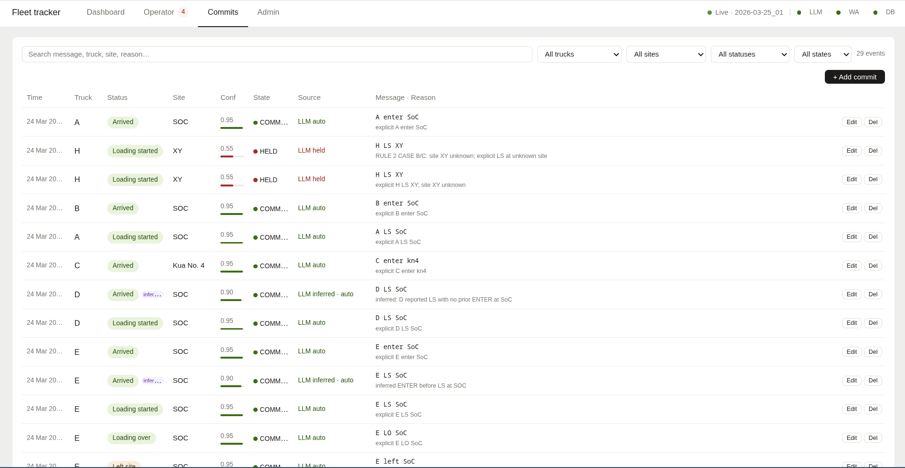
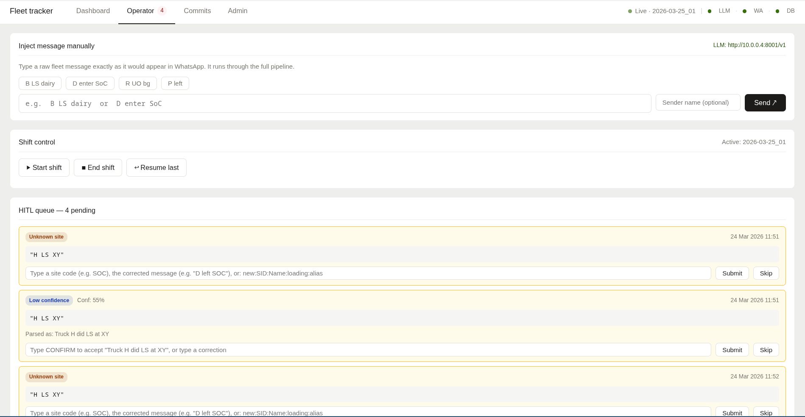

# Fleet Tracker — WhatsApp-Native LLM Pipeline for Real-Time Fleet Operations

Real-world structured prediction from noisy, informal WhatsApp messages. Operators send terse, typo-ridden status updates (`"D lefy SOC"`, `"A,B LS"`, `"H LS XY"`) — the system parses them into structured events, resolves ambiguity through a WhatsApp-native HITL loop, and streams the results to a live operator dashboard.

Built for actual paddy-harvesting tractor-trolley fleets. Running in production.

---

## Screenshots

**Live operator dashboard** — fleet KPIs, per-site occupancy, and shift summary updating in real time via WebSocket.



**Structured event log** — every raw WhatsApp message mapped to its parsed events with commit status, confidence, LLM reasoning, and edit controls.



**Operator panel** — manual message injection and the HITL queue showing open questions waiting for operator clarification (answered by replying in WA, no web UI needed).



---

## The Problem

Operators don't use structured forms. They use WhatsApp. Messages look like:

```
D LS SOC          →  Truck D, Loading Started, site SOC
A,B enter KN4     →  Truck A + B, ENTER, site KN4
H LS              →  Truck H, Loading Started, site ??? (unknown)
sorry D not B     →  Correction: previous event was D, not B
D lefy            →  Typo for "D left" (LEFT event, site inferred)
```

The challenge: extract structured events reliably from messages that are abbreviated, code-switched, typo-ridden, and context-dependent — where the correct interpretation requires knowing the truck's current state in an ongoing operational cycle.

---

## Architecture

```
WhatsApp Group
  │  Baileys WebSocket
  ▼
wa_listener (Node.js)  ──POST──▶  fleet_pipeline (FastAPI/Python)
                                          │
                         Level1 ──▶ Level2 ──▶ Level3 (LLM) ──▶ Committer
                                                                      │
                                                             SQLite (WAL mode)
                                                                      │
                                                          WebSocket ──▶ Dashboard
```

**When confidence is low or entities are unresolved:**

```
Committer creates HITL question
  │
  ▼
wa_notifier calls Node.js /send-reply
  │
  ▼  (bot quotes the original message in WA group)
"❓ Unknown site 'XY'. Reply with site code e.g. SOC"
  │
  ▼  (operator replies in WA — no web UI needed)
ingest.py detects contextInfo.stanzaId match → routes as HITL answer
  │
  ▼
Re-process original message with operator_clarification injected into LLM context
```

---

## Pipeline Design

### Level 1 — Message extraction
Parses Baileys real-time events or WA chat exports into structured dicts. Preserves `wa_message_id` as `msg_id` so HITL questions can quote the original WA message.

### Level 2 — Rule-based enrichment
Fuzzy token matching against truck/site registries. Builds candidate sets without making commit decisions — feeds them into the LLM context window.

### Level 3 — Constrained LLM inference
Sends a structured prompt to any OpenAI-compatible server. The prompt includes:
- Operational context (truck cycle definition, site registry, status codes)
- Rolling L3_CONTEXT window (last 12 committed events for temporal reasoning)
- All parsing rules (see below)
- `operator_clarification` if this is a HITL re-process

The LLM must output strict JSON. Non-JSON output → message held.

### Committer — Deterministic post-processing
Applies rules the LLM shouldn't need to reason about each time:
- **Cycle-aware ENTER injection**: LS/US without prior ENTER → infer ENTER (confidence bounded by triggering event's confidence — not hardcoded)
- **Single HITL per event**: UNKNOWN_SITE suppresses LOW_CONFIDENCE (one bot message, not two)
- **Confidence thresholds**: ≥0.85 → COMMITTED · 0.60–0.85 → FLAGGED · <0.60 → HELD
- **WA metadata threading**: stores `original_wa_message_id` + `group_jid` on HITL questions so the notifier can quote correctly

---

## Key Engineering Decisions

**Cycle-aware site inference (RULE 2)**
The naive approach inherits the last known site at any confidence — this causes silent commit errors when a truck starts a new cycle at a different site. The fix: site inference is only high-confidence (≤0.90) when the truck has an *open* cycle at a known site (last status ∈ {ENTER, LS, US}). After a closed cycle (LEFT/UO), ENTER gets site_id=null → HITL.

**HITL via WA reply threading**
The operator's phone is already open. Routing clarifications back into WA (quoting the original message via Baileys `contextInfo`) means zero context switching. The `bot_wa_message_id` → `question_id` mapping in SQLite lets the ingest route detect replies in O(1) without scanning.

**msg_id = wa_message_id**
WA messages' Baileys key IDs are used directly as `msg_id`. This prevents duplicate `raw_messages` rows when HITL re-processes the same original message (a previous bug: re-processing always generated new UUIDs, causing phantom duplicates in the message map).

**Sequential LLM calls**
Later messages in the same batch need context from earlier ones. LLM calls are serialised via `asyncio.Semaphore(1)` inside `_process_and_broadcast`.

---

## Tech Stack

| Layer | Tech |
|-------|------|
| WA real-time | Node.js 20, [@whiskeysockets/baileys](https://github.com/WhiskeySockets/Baileys) |
| API server | FastAPI, uvicorn, WebSockets |
| LLM inference | Any OpenAI-compatible server (tested: vllm + Qwen2.5-7B-Instruct-AWQ, GLM-4-Flash) |
| Database | SQLite (WAL mode), 13 tables, idempotent migrations |
| Dashboard | Vanilla JS, single HTML file, WebSocket-pushed updates |
| Deployment | Docker Compose (api + wa + nginx), or PM2 bare-metal |

---

## Running It

### Docker (recommended)

```bash
cp .env.example .env
# Set HOST_PORT, FLEET_LLM_BASE_URL

make up        # build + start
make qr        # scan WA QR (first run)
# Open http://localhost:HOST_PORT
```

### Bare metal

```bash
pip install -r requirements.txt
python -m fleet_pipeline.db.migrate

# Terminal 1
uvicorn fleet_pipeline.api.main:app --port 8000

# Terminal 2
cd fleet_pipeline/wa_listener && npm install && node index.js
```

Full setup: [docs/deployment.md](docs/deployment.md)

---

## LLM Requirements

Any OpenAI-compatible inference server. Tested with:

```bash
vllm serve Qwen/Qwen2.5-7B-Instruct-AWQ --port 8001
# FLEET_LLM_BASE_URL=http://localhost:8001/v1
```

Set `FLEET_LLM_MOCK=true` to bypass the LLM entirely for local development.

---

## Project Layout

```
fleet_pipeline/
├── pipeline/
│   ├── level1.py           Timestamp + text extraction
│   ├── level2.py           Rule-based vocab enrichment
│   ├── level3.py           LLM prompt construction + JSON parsing
│   ├── committer.py        Post-LLM deterministic rules + DB write
│   ├── hitl_queue.py       HITL question factory
│   └── wa_notifier.py      WA bot reply via Node.js /send-reply
├── api/
│   ├── pipeline_service.py Orchestration + WA metadata threading
│   └── routes/
│       ├── ingest.py       WA intake + HITL reply routing
│       ├── hitl.py         Answer/dismiss endpoints
│       ├── analytics.py    Shift summary, cycle counts
│       └── registry.py     Truck/site/shift config CRUD
├── prompts/
│   └── level3_prompt_template.txt   All parsing rules (RULE 1–9)
├── db/
│   ├── schema.sql          Full schema (13 tables)
│   └── database.py         All read/write helpers
└── wa_listener/index.js    Baileys listener + /send-reply server
```

---

## Docs

- [Architecture & data flow](docs/architecture.md)
- [Pipeline & LLM rules](docs/pipeline.md)
- [Deployment guide](docs/deployment.md)
- [API reference](docs/api.md)
